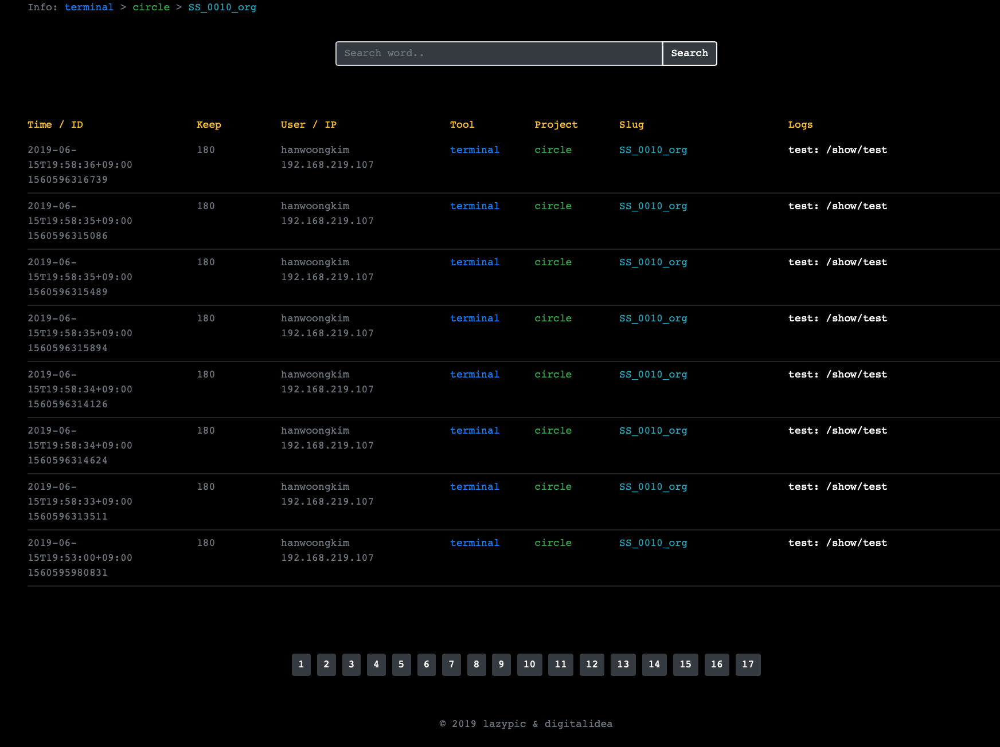

# dilog




디지털아이디어 웹용 로그서버 입니다.
조직에서 만들어지는 툴중 로그에 대한 기록이 필요할 경우가 있습니다. 프로젝트 매니징툴의 로그를 기록하기위해 만들었지만, 다른툴에서도 활용할 수 있도록 제작했습니다.

### Download
바이너리 하나만 필요합니다. 다운로드 합니다.

- Linux:
- macOS:
- Windows:

### mongoDB 설치, 실행
monogoDB를 설치하고 실행합니다.

macOS
```bash
$ brew install mongodb // macOS
$ mongod
```

CentOS
```bash
$ sudo yum install mongodb mongodb-server
```

### 서버실행
실행파일로 서버를 실행할 수 있습니다.
```
# dilog -http :80
```

mongodb 서버 IP가 10.0.90.251이고 dilog를 :8080 포트로 실행하는 방법은 아래와 같습니다.

```bash
$ dilog -http :8080 -dbip 10.0.90.251
```


### 로그추가: Commandline
기본적으로는 2개의 인수만 추가하더라도 로그를 사용할 수 있습니다.

```bash
$ dilog -tool 툴이름 -log="로그내용"
```

다른 인수들을 활용하여 로그를 복잡하게 넣을 수 있습니다.

> 예시 : toolA 에서 circle 프로젝트 SS_0010_org 샷에 "A버튼을 눌렀다." 라는 로그를 365일 보관

```bash
$ dilog -tool tooA -project circle -slug SS_0010_org -log "A버튼을 눌렀다." -keep 365
```

### 로그추가: RestAPI
- curl을 이용해서 로그를 POST하는 방법

```
$ curl -X POST -d "project=circle&slug=SS_0010_org&tool=csi3&user=woong&keep=180&log=log_text" http://127.0.0.1:8080/api/setlog
```

### 로그삭제: Commandline
기본적으로 로그 데이터는 가지고 있습니다.
아래 명령어를 통해서 시간이 지난 로그를 지울 수 있습니다.

```bash
$ dilog -rm
```

id를 이용해서 삭제하는 방법
```
$ dilog -rmid 0000000000000
```
